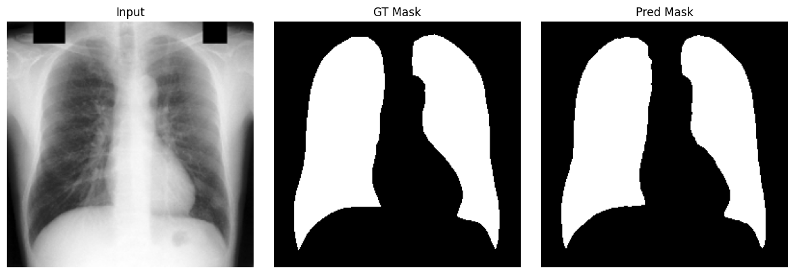

# U-Net

본 문서는 **과제 제출용 요약 + 학습 노트**를 함께 담은 README입니다. 이번 과제의 목표는 대표적인 컴퓨터 비전 모델을 조사하고, 해당 모델에 적합한 공개 데이터셋을 찾아 다양한 태스크를 실험해보는 것입니다. 본 README는 **모델 조사 → 데이터셋 조사 → 실험 설계 및 수행 → 결과 분석**의 흐름으로 구성하였으며, 논문 기반 핵심 내용과 실험 구현의 차이점을 함께 정리하였습니다.


_출처: U-Net 원 논문(arXiv:1505.04597) 기반 이미지_

---

## 핵심 아이디어 요약 (제출용 한눈 요약)

- Encoder–Decoder 구조로 **전역 의미(Context)** 와 **정밀 위치(Localization)** 를 동시에 확보합니다.
- 동일 해상도 레벨에서 **Skip Connection**으로 특징을 결합합니다.
- **Overlap-Tile** 전략으로 큰 이미지도 안정적으로 예측합니다.
- 경계 성능을 위해 **Mirror Extrapolation**을 사용합니다.
- 접촉 세포 분리를 위해 **Weight Map 기반 Loss**를 적용합니다.

---

## 1. 모델 조사

### 1.1 모델 등장 배경

U-Net은 2015년에 의료 영상 분할을 위해 제안된 모델입니다. 당시 의료 영상은 데이터 수가 제한적이고, 작은 구조물의 경계를 정확히 분할해야 하는 경우가 많았습니다. 기존의 패치 기반 분류 방식은 연산량이 크고, 픽셀 단위 결과를 얻기 어렵거나 경계 품질이 떨어지는 문제가 있었습니다. U-Net은 **FCN 기반의 end-to-end 학습**을 통해 전체 이미지를 입력으로 받아 픽셀 단위 출력을 직접 예측하며, **skip connection**으로 미세한 위치 정보를 보존하여 경계 예측을 강화하도록 설계되었습니다.

### 1.2 핵심 구조와 동작 원리

U-Net은 이미지의 **전반적인 컨텍스트(Context) 정보를 얻기 위한 네트워크**와, **정확한 지역화(Localization)를 위한 네트워크**가 대칭적으로 결합된 구조를 가집니다. 전체 구조는 크게 두 부분으로 나뉩니다.

- **Contracting Path (수축 단계)**: 입력 이미지로부터 전역적인 의미 정보를 추출합니다.
- **Expanding Path (팽창 단계)**: 픽셀 단위의 세밀한 Segmentation 결과를 생성합니다.

두 경로는 동일한 해상도 단계에서 **Skip Connection**으로 연결되어 있으며, 이는 U-Net 성능의 핵심 요소입니다. Encoder에서 얻은 얕은 층의 위치 정보와 Decoder에서 복원되는 의미 정보를 결합함으로써, 경계가 정밀한 분할 결과를 얻을 수 있습니다.

### 1.3 Architecture 요약 표

| 구간                       | 주요 연산                       | 목적                    |
| -------------------------- | ------------------------------- | ----------------------- |
| Contracting Path (Encoder) | Conv 3x3 x2 + ReLU, MaxPool 2x2 | 전역 의미(Context) 추출 |
| Bottleneck                 | Conv 3x3 x2 + ReLU              | 추상 특징 요약          |
| Expanding Path (Decoder)   | Up-Conv 2x2, Conv 3x3 x2 + ReLU | 픽셀 단위 복원          |
| Skip Connection            | 동일 해상도 특징 연결           | 위치 정보 보존          |

### 1.4 세부 구조 설명

#### Contracting Path — 수축 단계 (Encoder)

- 3×3 Convolution을 두 차례 반복하고 ReLU를 적용합니다.
- 2×2 Max Pooling으로 Down-sampling을 수행합니다.
- Down-sampling이 진행될 때마다 채널 수가 2배로 증가합니다.
- 공간 해상도는 감소하지만 **전역 의미 정보(Global Context)**를 포함하는 특징 표현을 학습합니다.

#### Expanding Path — 팽창 단계 (Decoder)

- 2×2 Up-Convolution(Transposed Convolution)으로 Up-sampling을 수행합니다.
- 채널 수는 절반으로 감소합니다.
- 3×3 Convolution을 두 차례 반복하고 ReLU를 적용합니다.
- 동일 해상도의 Encoder 특징과 Concatenation을 수행합니다.
- 마지막에 1×1 Convolution으로 픽셀 단위 클래스 예측을 수행합니다.

#### Skip Architecture (Skip Connection)

- 얕은 층의 **fine-grained location 정보**와 깊은 층의 **global semantic 정보**를 결합합니다.
- Localization 정확도와 Context 정보 간의 트레이드오프를 완화합니다.
- 작은 병변이나 세포 경계처럼 미세 구조를 분할할 때 강점을 가집니다.

#### Overlap-Tile Input Strategy

- 고해상도 입력을 타일로 분할하여 메모리 사용량을 줄입니다.
- 타일 간 일부 영역을 겹치게 하여 경계 예측 안정성을 높입니다.
- 출력 크기가 줄어드는 valid convolution 구조에서 특히 유용합니다.

#### Boundary Handling — Mirror Extrapolation

- Zero padding 대신 Mirror Extrapolation으로 경계 정보를 보완합니다.
- 경계 픽셀에서도 자연스러운 예측이 가능하도록 합니다.

#### Touching Cells Separation

- 접촉 객체 분리를 위해 경계에 가중치를 주는 **weight map**을 사용합니다.
- 경계 픽셀에 더 큰 가중치를 부여하여 분리 성능을 높입니다.
- 의료 영상에서 흔한 “붙어 있는 구조물” 분할에 효과적입니다.

### 1.5 주요 설계 포인트(논문 기준)

- **Valid convolution**을 사용하여 출력 크기가 입력보다 작아지는 구조입니다.
- 큰 의료 영상에서 **Overlap-Tile** 전략을 사용하여 안정적인 예측을 수행합니다.
- **Mirror Extrapolation**으로 경계 부근의 정보 손실을 보완합니다.
- 접촉 객체 분리를 위해 **weight map 기반 loss**를 적용합니다.
- 데이터 증강으로 **elastic deformation**을 강조합니다.

### 1.6 기존 모델 대비 장점과 한계

- 장점
  - Skip connection으로 **정밀한 경계 복원**에 유리합니다.
  - FCN 기반 end-to-end 학습으로 **추론 효율**이 높습니다.
  - 강한 데이터 증강으로 **적은 데이터**에서도 학습이 가능합니다.
- 한계
  - 고해상도 입력은 메모리 부담이 크며 타일링 기반 추론이 필요할 수 있습니다.
  - 경계가 불명확하거나 클래스 불균형이 큰 경우 성능 변동이 발생할 수 있습니다.
  - 일반 자연 이미지보다 의료 영상에 최적화된 설계라는 한계가 있습니다.

---

## 2. 데이터셋 조사

### 2.1 사용 데이터셋: JSRT Lung Segmentation

본 실험에서는 **JSRT Lung Segmentation** 데이터셋을 사용하였습니다.

- 데이터 규모: 247장(이미지/마스크 1:1 대응)입니다.
- 입력 형태: 흑백(1채널) Chest X-ray 이미지입니다.
- 원본 크기: 224x224입니다.
- 클래스: 폐 영역(1)과 배경(0)의 **2-class binary segmentation**입니다.
- 마스크 값: 0~255 범위이며 실험에서는 0/1로 이진화합니다.

데이터 경로(프로젝트 기준)

- `datasets/jsrt/content/jsrt/cxr/` : X-ray 이미지(PNG)
- `datasets/jsrt/content/jsrt/masks/` : 마스크(PNG)

### 2.2 데이터셋 선택 이유

- 흉부 X-ray는 의료 영상 분할의 대표 사례입니다.
- 폐 영역은 경계가 명확하면서도 구조가 복잡하여 U-Net 평가에 적합합니다.
- 공개 데이터로 접근성이 좋아 재현 가능성이 높습니다.

---

## 3. 실험 설계 및 수행

### 3.1 태스크 정의

- 태스크: Lung **Binary Segmentation**입니다.
- 입력/출력:
  - 입력: (B, 1, 256, 256) 흑백 이미지입니다.
  - 출력: (B, 1, 256, 256) 픽셀 단위 로짓입니다.

### 3.2 전처리 및 데이터 분할

- 리사이즈: 모든 이미지를 256x256으로 리사이즈합니다.
- 마스크 이진화: `mask > 0.5` 기준으로 0/1로 변환합니다.
- 데이터 분할: train/val = 8:2, seed=42로 고정합니다.

### 3.3 모델 구현(실험 코드 기준) 및 논문과의 차이

- 구현: Conv(3x3, padding=1) + BatchNorm + ReLU를 사용하는 U-Net 변형입니다.
- 논문과의 차이:
  - 원 논문은 valid convolution(패딩 없음)으로 출력 크기가 줄어듭니다.
  - 본 구현은 padding=1로 공간 크기를 유지하며, 업샘플링 후 크기 불일치 시 `interpolate`로 보정합니다.
  - 원 논문에는 BatchNorm 언급이 없으나 본 구현에서는 BatchNorm을 사용합니다.

### 3.4 학습 설정

- Optimizer: Adam입니다.
- Learning rate: 1e-3입니다.
- Epochs: 10입니다.
- Batch size: 8입니다.
- Device: macOS MPS를 사용합니다(가능한 경우).

### 3.5 손실 함수 및 평가 지표

- Loss: `BCEWithLogits + Dice Loss` 조합을 사용합니다.
- Metric:
  - Dice coefficient
  - IoU(Jaccard)

### 3.6 실행 방법

- 노트북: `notebooks/unet_jsrt.ipynb`에서 전체 실험을 실행합니다.
- 데이터 경로가 다르면 노트북 상단의 `IMAGE_DIR`, `MASK_DIR`를 수정합니다.
- 모델/지표 구현 파일:
  - `models/unet.py`
  - `utils/metrics.py`

---

## 4. 결과 분석

### 4.1 정량 결과(Validation)

학습 로그(10 epochs) 기준 결과입니다.

| Epoch | Val Loss | Val Dice | Val IoU |
| ----: | -------: | -------: | ------: |
|     1 |   0.9587 |   0.6912 |  0.5309 |
|     2 |   0.3606 |   0.9181 |  0.8504 |
|     3 |   0.2001 |   0.9586 |  0.9209 |
|     4 |   0.1505 |   0.9631 |  0.9291 |
|     5 |   0.1170 |   0.9698 |  0.9416 |
|     6 |   0.1138 |   0.9690 |  0.9403 |
|     7 |   0.1054 |   0.9696 |  0.9413 |
|     8 |   0.0908 |   0.9731 |  0.9479 |
|     9 |   0.0830 |   0.9744 |  0.9503 |
|    10 |   0.0780 |   0.9753 |  0.9521 |

최종 epoch(10)에서 **Val Dice 0.9753**, **Val IoU 0.9521**을 확인하였습니다.

### 4.2 정성 결과 해석

- 학습 초반(1~2 epoch)에는 손실이 빠르게 감소하고 Dice/IoU가 급격히 상승합니다.
- 3~5 epoch 이후에는 성능 향상이 완만해지며, 안정적으로 수렴하는 경향을 보입니다.
- 데이터 규모가 크지 않음에도 불구하고 높은 Dice/IoU를 달성하여 U-Net의 효율성을 확인할 수 있습니다.

### 4.3 모델의 장단점 및 적합한 상황

- 적합한 상황
  - 폐/장기/병변처럼 **경계가 중요한 의료 영상 Segmentation**에 적합합니다.
  - 데이터가 크지 않더라도(증강 포함) 학습이 가능한 구조입니다.
- 주의할 상황
  - 고해상도 입력은 타일링/패치 기반 추론을 고려해야 합니다.
  - 클래스 불균형이 큰 경우(예: 작은 병변)에는 손실/샘플링 전략 추가가 필요할 수 있습니다.

---

## 5. 결과 시각화



---

## 한계 및 주의점 (학습 노트)

- Padding을 쓰지 않는 논문 원형 U-Net에서는 출력 Segmentation map 크기가 입력보다 작습니다.
- 고해상도 의료 영상은 메모리 부담이 크며, Overlap-Tile로 보완합니다.
- 경계 예측 품질은 데이터 특성에 따라 민감하게 변합니다.
- 데이터셋이 단일 도메인에 국한되면 일반화에 한계가 있을 수 있습니다.

---

## 참고/출처 (제출용)

- U-Net 원 논문: Olaf Ronneberger, Philipp Fischer, Thomas Brox. **U-Net: Convolutional Networks for Biomedical Image Segmentation**. arXiv:1505.04597 (2015)입니다.
- 그림 출처: 모든 이미지(아키텍처)는 로컬 파일(`../img/unet3.png`)로 통일하고, 논문 기반임을 캡션에 표기했습니다.

아래는 과제 제출 시 참고 가능한 BibTeX입니다.

```bibtex
@article{ronneberger2015unet,
  title   = {U-Net: Convolutional Networks for Biomedical Image Segmentation},
  author  = {Ronneberger, Olaf and Fischer, Philipp and Brox, Thomas},
  journal = {arXiv preprint arXiv:1505.04597},
  year    = {2015}
}
```